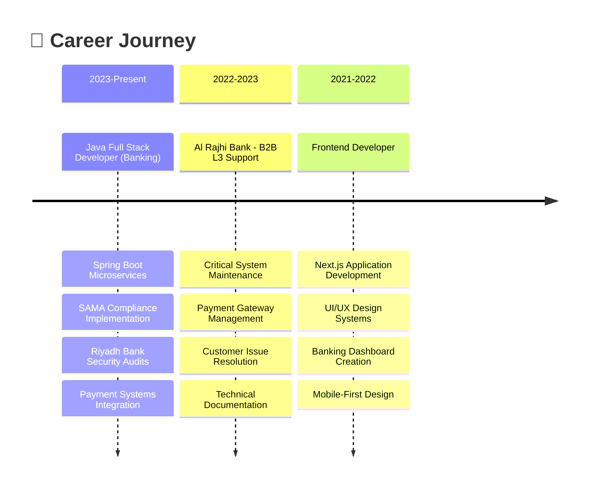

```
 ▗▄▖▗▄▄▄▖▗▖ ▗▖▗▖ ▗▖▗▖       ▗▄▄▖      ▗▄▄▖▗▖ ▗▖▗▄▄▄  ▗▖ ▗▖▗▄▄▄▖▗▄▄▄▖▗▄▄▖ 
▐▌ ▐▌ █  ▐▌ ▐▌▐▌ ▐▌▐▌       ▐▌ ▐▌    ▐▌   ▐▌ ▐▌▐▌  █ ▐▌ ▐▌▐▌   ▐▌   ▐▌ ▐▌
▐▛▀▜▌ █  ▐▛▀▜▌▐▌ ▐▌▐▌       ▐▛▀▘      ▝▀▚▖▐▌ ▐▌▐▌  █ ▐▛▀▜▌▐▛▀▀▘▐▛▀▀▘▐▛▀▚▖
▐▌ ▐▌ █  ▐▌ ▐▌▝▚▄▞▘▐▙▄▄▖    ▐▌       ▗▄▄▞▘▝▚▄▞▘▐▙▄▄▀ ▐▌ ▐▌▐▙▄▄▖▐▙▄▄▖▐▌ ▐▌
 ```
🧑‍💻 Full Stack Developer | 🔐 Security Specialist | 🏦 Banking Systems Expert 

---
  
<div align="center">
  
  
  
  
  
  
  
  
  
  
  
  
</div>

  

<div align="center">
  
  
  
</div>


## 🛠️ **Tech Stack**

### 🖥️ **Backend Development**
<div align="left">
  
  
  
  
  
  
  
  
  
  
</div>

### 🎨 **Frontend Development**
<div align="left">
  
  
  
  
  
  
  
  
  
</div>

### 🔐 **Security & Compliance**
<div align="left">
  
  
  
  
  
  
  
  
</div>

### ☁️ **DevOps & Cloud**
<div align="left">
  
  
  
  
  
  
  
  
</div>

### 🤖 **Automation & Tools**
<div align="left">
  
  
  
  
  
  
  
  
</div>

---

## 💼 **Professional Experience**



---

## 🏆 **Featured Projects**

### 🏦 **Banking Security Suite**
```
🔧 Tech Stack: Spring Boot, React, OAuth2, HashiCorp Vault
🎯 Features: SAMA compliance, Real-time monitoring, Audit trails
🛡️ Security: Multi-layer authentication, Encryption at rest
```

### 🤖 **n8n Automation Hub**
```
🔧 Tech Stack: n8n, Node.js, Telegram API, AWS Lambda
🎯 Features: Workflow automation, Alert systems, Data sync
⚡ Performance: 24/7 monitoring, Real-time notifications
```

### 🎨 **Enterprise UI Components**
```
🔧 Tech Stack: Next.js, Tailwind CSS, Storybook, TypeScript
🎯 Features: Reusable components, Design system, Accessibility
📱 Responsive: Mobile-first, Cross-browser compatibility
```

### 🔒 **Identity Management System**
```
🔧 Tech Stack: Keycloak, Spring Security, PostgreSQL
🎯 Features: SSO, Role-based access, Session management
🛡️ Compliance: SAMA requirements, Audit logging
```

```
🏆 Key Accomplishments:
├── 🏦 Successfully implemented SAMA compliance for 2 major banks
├── 🔒 Resolved 27+ critical security vulnerabilities
├── 🚀 Built 15+ production-ready banking applications
├── ⚙️ Automated 50+ manual processes using n8n
└── 👥 Led technical teams of 5+ developers
```

---

## 🌟 **What I'm Currently Working On**

- 🏦 **Next-gen Banking Platform**: Building microservices architecture with Spring Boot
- 🔐 **Security Framework**: Developing SAMA-compliant security tools
- 🤖 **AI Integration**: Adding ML-powered fraud detection
- 📱 **Mobile Banking**: Creating React Native banking apps
- 🛠️ **DevOps Pipeline**: Implementing complete CI/CD automation

---

## 🤝 **Let's Connect**

<div align="center">
  
  <a href="https://linkedin.com/in/athul-sudheer">
    
  </a>
  <a href="https://twitter.com/syntax_mind">
    
  </a>
  <a href="mailto:athul@syntax-mind.dev">
    
  </a>
  <a href="https://calendly.com/athul-sudheer">
    
  </a>
  <a href="https://github.com/syntax-mind">
    
  </a>
  
</div>

---

<div align="center">
  
  
  
</div>

---

<div align="center">
  
  
  
</div>
